# sycira
symbolic circuit analyzer for the Maxima computer algebra system.

With sycira you get easily from a circuit:

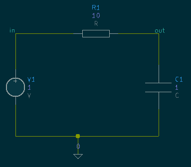

to the equations which describe the circuit:

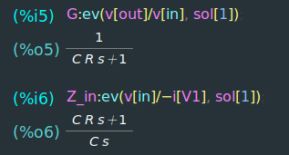

sycira supports the following elements:

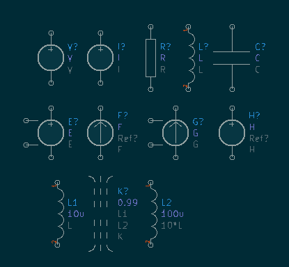

- V and I: independant voltage and current sources
- R, L, C: common passive elements: resistor, inductors and capacitors
- Controlled sources:
    - E: VCVS (voltage controlled voltage source)
    - F: CCCS (current controlled current source)
    - G: VCCS (voltage controlled current source)
    - H: CCVS (current controlled voltage source)
- K: coupling between inductors


## Tutorial
### sycira
We like to get the transferfunction G of the following circuit:

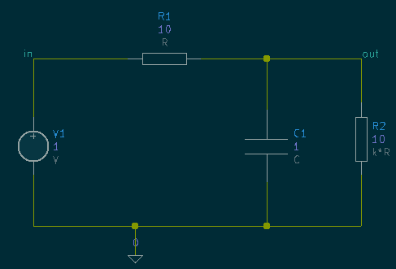

A wxMaxima session would look like this:

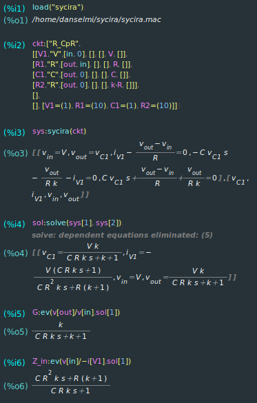

After starting maxima or wxMaxima we prepare to have the sycira function available: ```load("sycira");```. Then we have to describe the circuit with a netlist ```ckt:["R_CpR", ... ]```.
With ```sys:sycira(ckt);```we get a system of equations for maxima's solver.
Which will be solved by:```sol:solve(sys[1], sys[2]);```
We get the transferfunction $$G=\frac{v_{out}}{v_{in}}$$ the ratio from the output to the input by ```G:ev(v[out]/v[in],sol[1]);```. and the input impedance "seen" by the source V1 with ```Z_in:ev(v[in]/-i[V1], sol[1]) ```. The negative sign comes from the definition of the current throught the element V1. This is from pin 1 to pin 2 for all element types.

The creation of the netlist is error prone. In the next section we use KiCad to create the netlist and a minimal wxMaxima session.

### KiCad2sycira
Here we derive the transferfunction of an active multiple feedback low pass filter.
<!-- And calculate the element values to realize a butterwoth lowpass filter.-->

#### Preparation
In KiCad we create a new project and open the schematics editor. Here we have to add the components library with the sycira elements. In the menubar click on "Preferences"->"Manage Symbol Libraries...":

 

 We add a project specific library:

 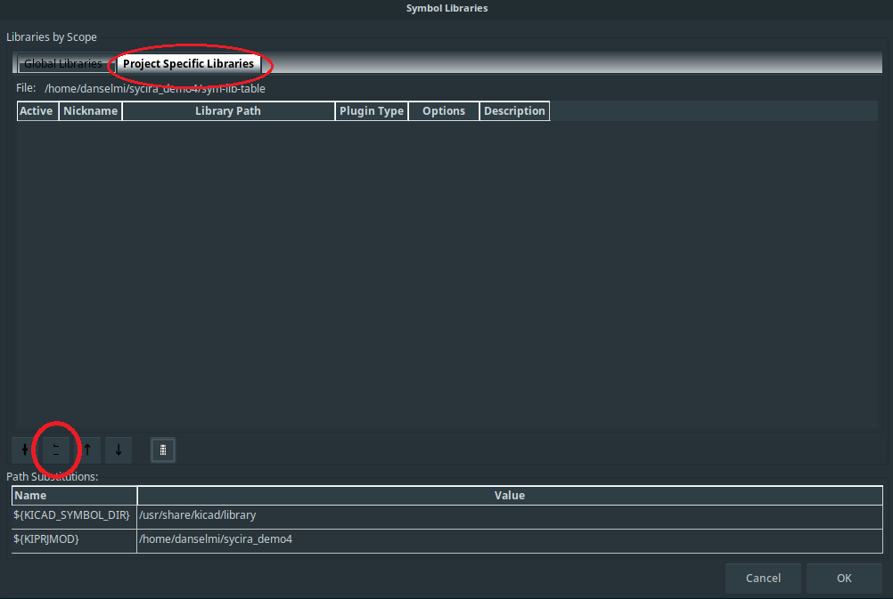

By default the library is installed in ```/usr/local/share/KiCad2sycira/```.

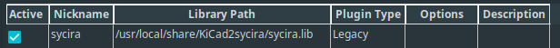

#### Drawing the schematic
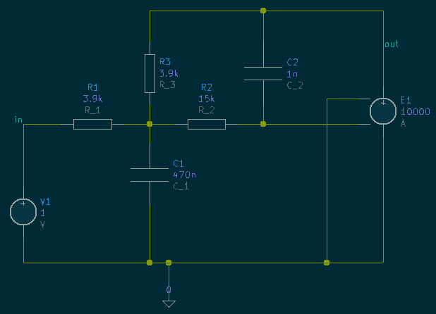

Remeber to add the 0-symbol. It will define the reference net with the name ```0```.
The field SymbolicValue is used by sycira as the value used in the equations. Here it is allowed to give algebraic expressions. In this example we just repeated the reference designator with and underscore to get nice subscripts in wxMaxima.
You don't have to define the Value fields. They are used in the numeric simulation integrated in KiCad.
Using net labels makes it easier to reference a node voltage later on.

#### Generate the netlist and wxMaxima session


Choose KiCad2sycira and click "Generate Netlist":

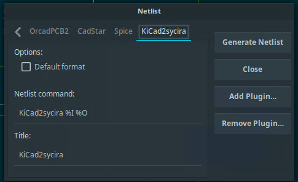

Choose a filename. The filename is used for [name].mac containing the netlist and [name].wxmx containing the  wxMaxima session.
If the session and the netlist file already exists, then only the netlist file will be overwritten. This is usefull if you like to change the circuit without loosing all inputs in the maxima session.
If not all elements have annotations KiCad will ask how to generate them.
Now the netlist and wxMaxima session are ready.

#### Get the desired answers from wxMaxima
Start wxMaxima by double clicking on the .wxmx file. Or open the file in wxMaxima.

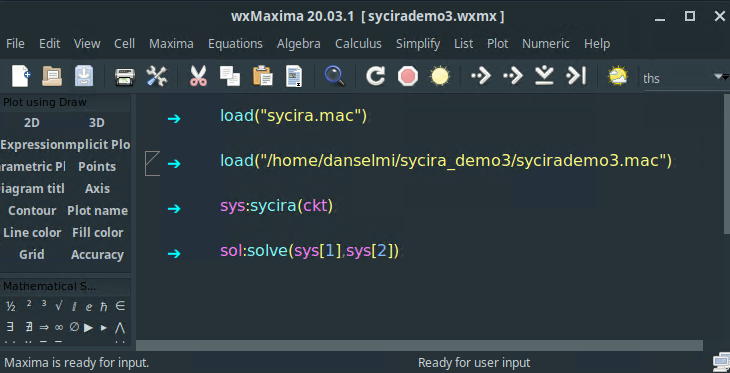

Press Ctrl+R to evaluate all Cells. (Or in the menu "Cell"->"Evaluate All Cells"). Maxima just calculated all element currents and node voltages!

To get the transferfunction: ```G:ev(v[out]/v[in], sol[1]);``` This is quite a complex relation.
To simplify this a bit we assume an ideal amplifier ```G:limit(G, A, inf);``` with infinite gain.

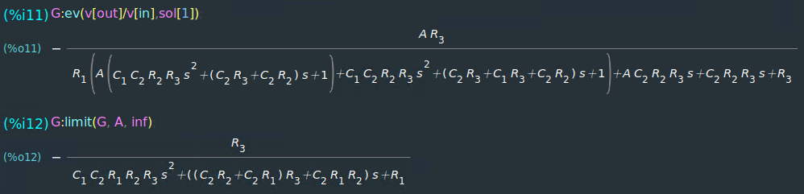
<!-- The poles of a butterwoth filter are given by:
$$S_P=-\sin{\frac{(2 k - 1)\pi}{2 n}} + j\cdot \cos{\frac{(2 k - 1)\pi}{2 n}}$$ -->


## Installation
### sycira
sycira is based on the computer algebra system Maxima. This has to be installed to be able to use sycira.
There is no need to install sycira. You can load the package by giving the full path, for example:
```
load("/home/username/sycira/sycira.mac");
```
However - to simply call `load("sycira")`, you have to add the following line to your `maxima-init.mac` file.
```
file_search_maxima: append(file_search_maxima, ["/home/username/sycira/###.mac"])$
```
Remember to adjust the path to the corresponding locations on your system.

### KiCad2sycira
#### Build and installation
To use KiCad2sycira you need KiCad. Optional  is wxMaxima for which a minimal session file is created.
KiCad2sycira depends on the libraries TinyXml and zip. So the coresponding -dev packages have to be installed for the build.

To install the runtime requirements and the development requirements on Fedora:
```
sudo dnf install kicad wxmaxima tinyxml2 libzip #runtime
sudo dnf install git make g++ tinyxml2-devel libzip-devel #build
```
And for Ubuntu:
```
sudo apt install kicad wxmaxima libtinyxml2-6 libzip5 #runtime
sudo apt install git make g++ libtinyxml2-dev libzip-dev #build
```
When these dependencies are ready KiCad2sycira can be built and installed with:
```
cd KiCad2sycira
make
sudo make install
```
Default location is ```/usr/loca/```, which can be changed by the he ```PREFIX``` environment variable.
Make sure ```$PREFIX/bin/``` is in the PATH.

#### Configuration of KiCad
After successfully installing KiCad2sycira open KiCad's Eeschema and go to Generate Netlist

 

Click "Add Plugin...". As Netlist command use the following:
```
KiCad2sycira %I %O
```
Choose ```KiCad2sycira``` as the name. Afterwards click on "OK".

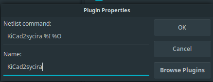


