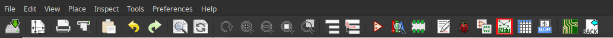
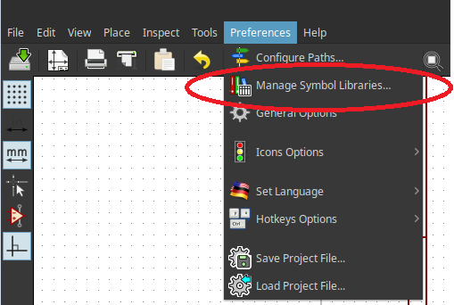

# sycira
symbolic circuit analyzer for the Maxima computer algebra system.

With the KiCad2Sycira plugin its possible to draw a schematic in Kicad and generate a Sycira netlist from the schematic.

# Prerequisites for KiCad2Sycira

- KiCad

```
sudo dnf install kicad
```
 
 - TinyXml2
```
sudo dnf install tinyxml2 tinyxml2-devel
```   

 - Zip

    
```
sudo dnf install zip
```
    

# Installation
There is no need to install Sycira. 
You can load the package by giving the full path, for example:
```
load("/home/username/sycira/sycira.mac");
```
To be able to simply call `load("sycira")`, you have to add the following line to your `maxima-init.mac` file.
```
file_search_maxima: append(file_search_maxima, ["/home/username/sycira/###.mac"])$
```
Remember to adjust the path to the corresponding locations on your system.

To use the KiCad2Sycira plugin simply build it with the corresponding Makefile.

After successfully building the KiCad2Sycira project open kicad and go to Generate Netlist

 

Click Addd Plugin and choose a plugin name.
As Netlist command use the following:
```
/home/<path to Sycira>/sycira/KiCad2Sycira/bin/Release/KiCad2Sycira %I %O
```
The final step is to add the Sycira kicad components library 

 

click on Preferences in the menubar -> Symbol Lobraries -> Browse Libraries and then add the sycira.lib file.

now you are ready!


# How to use KiCad2Sycira
Creat a new kicad Project and draw the schematic only using the Sycira components.
When you have your schematic run the befor added plugin. 
This will creat a Maxima Session +generating the Sycira netslist.
